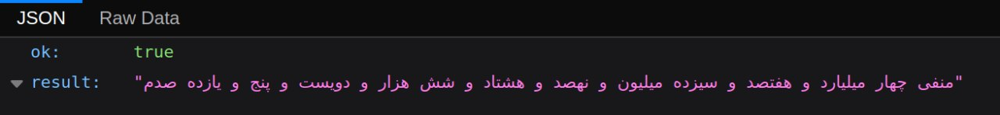
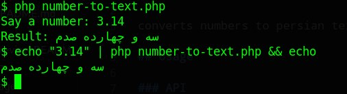
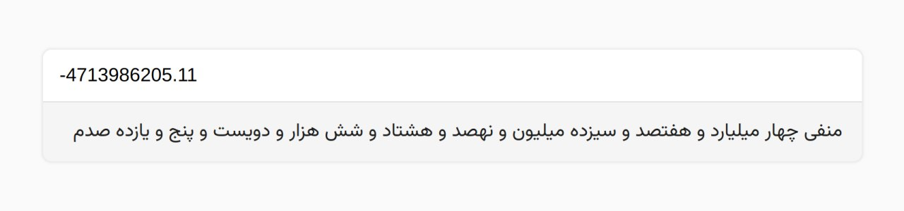

# number-to-text

converts numbers to persian text.

## Usage

### Library

Simply use:

```php
// checking the exists Library.
if (!file_exists("number-to-text.php")) {
  copy('https://raw.githubusercontent.com/hctilg/number-to-text/main/number-to-text.php', 'number-to-text.php');
}

// require Library.
$number_to_text = require_once('number-to-text.php');

$input = '<Your Number>';

$output = $number_to_text($input);

echo "Text: $output";
```

### API

Send requests to `/number-to-text.php`.

| Method |  Parameter  |
|:---------|:---------:|
| GET/POST | `string` number |



### CLI

run php script:

```bash
php number-to-text.php
```



<br>

## Test

### Web

Go to the `./number-to-text` folder and run php localhost:

```bash
php -S localhost:6040
```

then open the following url

```
http://localhost:6040/test.php
```



### CLI

run php script:

```bash
php test.php
```

